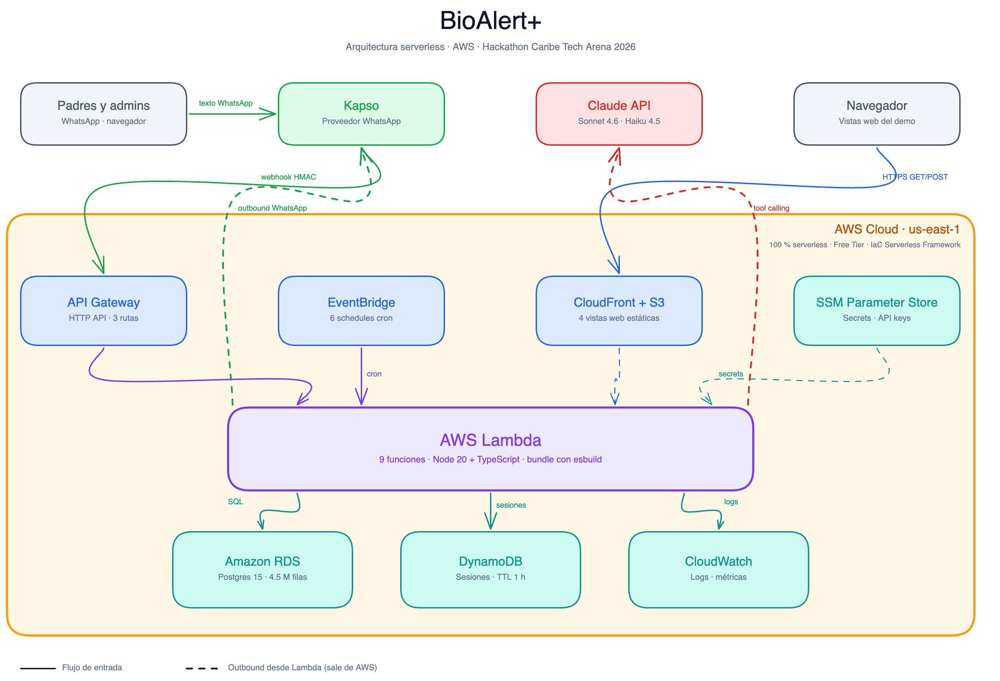

<div align="center">

# 🍎 BioAlert+

### El agente de WhatsApp que activa la data transaccional de las cafeterías escolares

*Convierte cada compra de cafetería escolar en una conversación inteligente — entre el padre, la cafetería y el bot.*

[](https://aws.amazon.com/serverless/)
[](https://aws.amazon.com/lambda/)
[](https://www.postgresql.org/)
[](https://aws.amazon.com/dynamodb/)
[](https://www.typescriptlang.org/)
[](https://nodejs.org/)
[](https://www.anthropic.com/claude)
[](https://www.serverless.com/)
[](https://caribetechcolombia.co)

[**🌐 Demo en vivo**](https://bioalert-web-hackathon-642722971137.s3.us-east-1.amazonaws.com/feature-catalog/index.html) · [**📊 Dashboard cafetería**](https://bioalert-web-hackathon-642722971137.s3.us-east-1.amazonaws.com/cafeteria-insights/index.html) · [**🏗 Arquitectura**](#-arquitectura) · [**👥 Equipo**](#-equipo)

</div>

---

## 📌 TL;DR

> Biofood opera ~90 colegios en Colombia con **millones de transacciones acumuladas** en Postgres que hoy no llegan al padre ni a la cafetería.
> Construimos un agente de WhatsApp serverless que las activa, convirtiéndolas en:
> recargas más altas con justificación nutricional, alertas proactivas de alérgenos / saldo / stock,
> reportes semanales automáticos, e insights cruzados padre↔cafetería.
>
> **Stack**: AWS Serverless (Lambda + RDS + DynamoDB + API Gateway + S3) · TypeScript · Claude Sonnet 4.6 + Haiku 4.5 · Kapso (WhatsApp).
> **Construido en**: 24 horas · 3 ingenieros · 1 product senior.
> **Impacto proyectado**: $1.0B – $2.1B COP anuales en recargas adicionales aplicado a los 90 colegios de Biofood.

---

## 🎯 El problema

El PRD de **Biofood** lo plantea sin rodeos: la plataforma de cafetería escolar acumula millones de transacciones (~4.26M ventas, ~305k recargas en el dataset del reto), pero los padres y administradores no las consumen porque:

1. **El padre** no sabe qué comió su hijo, cuánto saldo le queda, ni cuándo se va a acabar.
2. **La cafetería** no tiene benchmark contra otros colegios ni señales accionables de qué producto lanzar o discontinuar.
3. **Nadie** se entera a tiempo cuando un alérgeno aparece en el plato.

El reto del hackathon define **3 pilares**:

| Pilar | Métrica de éxito |
|---|---|
| 💰 **Ticket de recarga** | El padre recarga más y con mayor frecuencia |
| 🥗 **Visibilidad nutricional** | El padre entiende qué come su hijo |
| 📈 **Analítica para cafetería** | El admin toma decisiones de menú con benchmark |

---

## 💡 Nuestra solución

**BioAlert+** es un agente conversacional de WhatsApp respaldado por Claude Sonnet 4.6 con 9 tools registradas. Construido sobre la arquitectura serverless que pidió el PRD y extendido con **6 extensiones quirúrgicas** que cubren los 3 pilares del reto:

| ID | Extensión | Pilar |
|---|---|---|
| **EXT-1** | 3 opciones de recarga personalizadas con anchoring (Esencial · Equilibrada · Bienestar) y narrativa data-driven | 💰 |
| **EXT-2** | Reporte nutricional semanal proactivo + comparativa con compañeros + vista web | 🥗 |
| **EXT-3** | Reporte semanal a la cafetería con benchmark nacional + dashboard en React | 📈 |
| **EXT-4** | Explicabilidad obligatoria en cada respuesta ("te aviso esto porque…") | UX |
| **EXT-5** | Insight cruzado padre↔cafetería: señales agregadas de conversaciones se entregan al admin | 🔄 |
| **EXT-6** | Quick replies con WhatsApp interactive messages | 🎨 |

Más los 5 user stories del PRD oficial (US-01 a US-05): consumo del día, alerta de ausencia, alerta de alérgeno, proyección de saldo, alerta de stock crítico.

---

## 🌐 Demo en vivo

Todo está desplegado y se puede tocar en vivo. **No es vaporware** — endpoint público, datos reales del dataset del reto.

| Recurso | URL |
|---|---|
| 🎤 **Feature catalog** (landing del demo) | <https://bioalert-web-hackathon-642722971137.s3.us-east-1.amazonaws.com/feature-catalog/index.html> |
| 📊 **Dashboard cafetería** (React) | <https://bioalert-web-hackathon-642722971137.s3.us-east-1.amazonaws.com/cafeteria-insights/index.html> |
| 🍎 **Reporte nutricional** (Chart.js) | <https://bioalert-web-hackathon-642722971137.s3.us-east-1.amazonaws.com/nutrition-report/index.html?student=0010204385> |
| 💳 **Wompi mock checkout** | <https://bioalert-web-hackathon-642722971137.s3.us-east-1.amazonaws.com/wompi-mock/index.html?plan=equilibrada&monto=150000&estudiante=Mateo> |
| 🔌 **HTTP API endpoint** | `https://c8brdpdf03.execute-api.us-east-1.amazonaws.com` |

> 💡 **Cómo usar la demo**: abre el **feature catalog**, cada capability tiene hasta 3 modos: `🤖 Disparar` envía un mensaje real a WhatsApp, `✓ Abrir WhatsApp` te da un atajo `wa.me` con texto pre-escrito, `↗ Ver vista` abre la página complementaria.

---

## 🏗 Arquitectura

<div align="center">

<picture>
  <source media="(prefers-color-scheme: dark)" srcset="./docs/bioalert-architecture-darkmode.png">
  <source media="(prefers-color-scheme: light)" srcset="./docs/bioalert-architecture-lightmode.png">
  
</picture>

</div>

**100 % serverless en AWS**. Cero servidores, cero containers, cero instancias EC2.

| Servicio AWS | Rol |
|---|---|
| ⚡ **AWS Lambda** | 9 funciones · Node.js 20 + TypeScript (síncronas + programadas) |
| 🛂 **Amazon API Gateway** (HTTP API) | 3 rutas públicas (`/webhook/kapso`, `/demo/trigger`, `/cafeteria-insights`) |
| 🗄 **Amazon RDS PostgreSQL 15.7** | `db.t4g.micro` — 4.26M ventas reales + tablas `bioalert.*` propias |
| 💾 **Amazon DynamoDB** | Sesiones conversacionales con TTL 1h |
| ⏰ **Amazon EventBridge** | 6 schedules (cada 60s, daily 12 PM / 7 AM / 8 AM, weekly Sun/Mon) |
| 📦 **Amazon S3 + CloudFront** | 4 vistas web estáticas + JSONs pre-generados |
| 🔐 **AWS SSM Parameter Store** | Secrets (Claude, Kapso, DB, demo token) |

Servicios externos:

| Servicio | Rol |
|---|---|
| 🤖 **Claude API** (Anthropic) | Sonnet 4.6 para conversación + tool calling · Haiku 4.5 para reportes batch |
| 📱 **Kapso** | Proveedor WhatsApp Sandbox (inbound vía webhooks HMAC) |
| 📤 **Meta Cloud API** | Outbound directo (elimina un salto de latencia) |

> 📐 Documento detallado completo: [`docs/architecture.md`](./docs/architecture.md).

---

## ✨ Features

### 👨‍👩‍👧 Para padres (conversacional)

| Capacidad | Cómo se invoca | Tool / Lambda |
|---|---|---|
| ¿Qué comió hoy? | "¿qué comió Mateo hoy?" | `get_student_consumption_today` |
| Resumen de la semana | "¿y esta semana cómo le fue?" | `get_student_consumption_week` |
| Análisis nutricional (azúcar/calorías/grasa/sodio) con peso real por unidad | "¿está comiendo mucha azúcar?" | `get_nutrition_summary` |
| Comparación con compañeros | "¿come más azúcar que sus compañeros?" | `compare_to_peers` |
| Saldo + proyección en días hábiles | "¿cuánto saldo le queda?" | `get_balance_projection` |
| 3 opciones de recarga con anchoring | "¿cuánto le recargo?" | `get_recharge_recommendations` |
| Confirmar y pagar con Wompi | "voy con la equilibrada" | `generate_payment_link` |

### 🏫 Para administradores de cafetería (conversacional)

| Capacidad | Tool |
|---|---|
| Stock crítico | `get_school_alerts` |
| Benchmark vs otros colegios | `get_cafeteria_benchmark` |

### ⏰ Alertas que llegan solas (event-driven)

| Capacidad | Schedule | Lambda |
|---|---|---|
| Alerta de alérgeno | cada 60 s | `allergen-polling` |
| Alerta de ausencia | 12 PM Bogotá (lun-vie) | `absence-cron` |
| Stock crítico diario | 7 AM Bogotá | `stock-cron` |
| Aviso de saldo bajo + CTA recarga | 8 AM Bogotá | `balance-cron` |
| Reporte nutricional semanal | Dom 6 PM | `nutrition-weekly` |
| Reporte semanal cafetería (benchmark + insight cruzado) | Lun 7 AM | `cafeteria-weekly` |

### 🎯 Diferenciadores no obvios

Estos no son botones pero separan a BioAlert+ de un chatbot escolar genérico:

- **🔍 Explicabilidad obligatoria**: cada respuesta del bot incluye *"te aviso esto porque…"* con justificación basada en datos reales. Nunca caja negra.
- **👨‍👩‍👧‍👦 Multi-hijo determinístico**: cuando un padre tiene varios hijos en el dataset, el bot elige el más activo con criterio reproducible (`COUNT(*) DESC, MAX(fecha) DESC, id ASC`).
- **🌎 Timezone Bogotá nativo**: todas las queries usan `now() AT TIME ZONE 'America/Bogota'`. Sin confusiones con un dataset que llega hasta fechas futuras.
- **📅 Días hábiles reales**: las proyecciones de saldo y los cálculos de cobertura de recarga descartan sábados y domingos (`EXTRACT(DOW FROM fecha) BETWEEN 1 AND 5`). "2 semanas escolares" = 10 días hábiles, no 14 calendario.

---

## 📊 Métricas y resultados

Sobre el colegio piloto (NIT `900000680`, ~500 estudiantes activos):

| Métrica del PRD | Objetivo | Estado |
|---|---|---|
| Respuesta conversacional | < 4 s | ✅ ~2-3 s |
| Detección de alérgenos | 100 % (regla determinista) | ✅ |
| Entrega de alerta crítica | < 30 s | ✅ |
| Procesamiento de alerta masiva | < 2 min | ✅ |
| Precisión proyección de saldo | ± 2 días hábiles | ✅ |

### Uplift proyectado a los 90 colegios de Biofood

| Escenario | Recarga adicional anual |
|---|---|
| Pesimista | $338 M COP |
| **Base** | **$1.014 B COP** |
| Optimista | $2.102 B COP |

> 📈 Cálculo detallado en [`analysis/results/uplift-pitch.md`](./analysis/results/uplift-pitch.md) con escenarios y supuestos transparentes.

### Caso demo "Diana y Mateo"

El piloto incluye una familia real del dataset re-mapeada al equipo: **Diana** (la madre, mapeada al teléfono de Miguel) tiene 2 hijos —  **Mateo** (perfil "alto consumo dulce", 41% del ticket en snacks) y **Antonella** (saldo sobregirado por $28.900 a día de hoy). Ambos casos disparan flujos diferentes del bot y demuestran la lógica multi-hijo en producción.

---

## 🧱 Estructura del repositorio

```
bioalert-caribetech-hackathon/
├── lambdas/                     ⚡ 9 funciones Lambda
│   ├── conversation-handler/    💬 Webhook Kapso + Sonnet 4.6 + 9 tools
│   │   ├── index.ts             │   handler principal
│   │   ├── tools/               │   9 tools registradas para Claude
│   │   ├── prompts/             │   system prompts
│   │   └── kapso-payload.ts     │   parse del webhook v2 de Kapso
│   ├── cafeteria-insights-api/  📊 GET /cafeteria-insights → dashboard
│   ├── demo-trigger/            🎤 Bridge para el feature catalog
│   ├── allergen-polling/        🚨 US-03 cada 60s
│   ├── absence-cron/            🕛 US-02 daily 12 PM
│   ├── stock-cron/              📦 US-05 daily 7 AM
│   ├── balance-cron/            💳 saldo bajo daily 8 AM
│   ├── nutrition-weekly/        🥗 EXT-2 Dom 6 PM
│   ├── cafeteria-weekly/        📈 EXT-3 + EXT-5 Lun 7 AM
│   └── shared/                  🔧 db, whatsapp, claude, dynamo, ssm, logger
│
├── web/                         🌐 Vistas estáticas (S3 + CloudFront)
│   ├── feature-catalog/         🎤 Landing del demo (HTML + vanilla JS)
│   ├── cafeteria-insights/      📊 React + Tailwind + Vite
│   ├── nutrition-report/        🍎 HTML + Chart.js
│   └── wompi-mock/              💳 Checkout simulado
│
├── data/
│   └── fixtures/                🗃 Schema + fixtures SQL (parent_phone_map,
│                                    student_allergens, inventory, etc.)
│
├── scripts/                     🔨 ETL, bootstrap nutrición, deploy helpers
│   ├── etl-reto-to-rds.sh       │   Clona el dataset del reto a RDS propia
│   ├── apply-schema.ts          │   Crea schemas + tablas bioalert.*
│   ├── apply-fixtures.ts        │   Carga fixtures
│   ├── bootstrap-nutrition.ts   │   Llama a Haiku para estimar nutrición
│   │                                de los top productos del piloto
│   ├── refresh-benchmark-cache.sh   Refresca bioalert.benchmark_nacional_cache
│   └── sync-web-to-s3.sh        │   Build + deploy de las vistas web
│
├── analysis/                    🔬 EDA + caso demo + cálculo de uplift
│   ├── queries/                 │   SQL exploratorio
│   └── results/                 │   caso-demo.md, uplift-pitch.md
│
├── docs/                        📚 Documentación
│   ├── architecture.md          │   Arquitectura detallada
│   ├── architecture.{png,svg,mmd}   Diagrama
│   ├── db-schema.md             │   Schema del dataset real + gotchas
│   ├── pitch-outline.md         │   Outline de 15 slides
│   ├── team-plan.md             │   Reparto del equipo en 24h
│   └── plans/                   │   Planes detallados por track
│
├── serverless.yml               ☁️ IaC — TODO el deployment
├── CLAUDE.md                    🧠 Memoria persistente del proyecto
└── README.md                    📖 Estás acá
```

---

## 🚀 Quick start

### Prerequisitos
- Node.js 20+
- AWS CLI configurada con perfil `biofood-hackathon`
- Acceso al RDS (credenciales en SSM)

### Deployment completo

```bash
# 1. Instalar dependencias
npm install

# 2. (primera vez) Aplicar schema y fixtures a RDS
npm run schema:apply
npm run fixtures:apply
npm run nutrition:bootstrap

# 3. Deploy de Lambdas + infra
npm run deploy

# 4. Build + deploy de vistas web a S3
npm run web:sync

# 5. Refrescar caches periódicos
./scripts/refresh-benchmark-cache.sh
```

### Probar un endpoint en vivo

```bash
# El dashboard de la cafetería sirve datos reales
curl https://c8brdpdf03.execute-api.us-east-1.amazonaws.com/cafeteria-insights?nit=900000680 | jq .summary

# Disparar una feature del catalog vía API (requiere token en SSM)
TOKEN=$(aws ssm get-parameter --name /bioalert/hackathon/demo/trigger-token \
  --with-decryption --query 'Parameter.Value' --output text)
curl -X POST https://c8brdpdf03.execute-api.us-east-1.amazonaws.com/demo/trigger \
  -H "X-Demo-Token: $TOKEN" \
  -H "Content-Type: application/json" \
  -d '{"feature":"recharge_recommendations"}'
```

### Variables de entorno

Todo lo sensible vive en SSM Parameter Store. La Lambda las carga en cold start. Para desarrollo local:

```bash
cp .env.example .env
# Pega valores reales — NO commitearlo
```

---

## 🎨 Decisiones técnicas (las que valen la pena defender)

### Por qué Sonnet 4.6 + Haiku 4.5 (y no el modelo del PRD)
El PRD pedía `claude-sonnet-4-20250514`, pero **se retira el 2026-06-15** (un mes post-hackathon). Sonnet 4.6 es estrictamente superior en tool calling al mismo precio ($3 / $15 per MTok). Haiku 4.5 reduce el costo de los crons a un tercio ($1 / $5).

### Por qué Kapso y no Twilio
Twilio sandbox no documenta soporte para *interactive messages* (botones + listas), que necesitábamos para EXT-6. Kapso tiene SDK TypeScript nativo, soporta `send-buttons`/`send-lists`, webhooks con HMAC, y opt-in instantáneo. El wrapper `lambdas/shared/whatsapp.ts` abstrae el canal para migrar a Meta Cloud API post-hackathon sin tocar Lambdas.

### Por qué clonar el dataset del reto a nuestra RDS
El reto expone un Postgres compartido entre ~200 equipos sin permiso `ALTER`. Sin índices propios, las queries pasaban los 4 s del PRD. Clonamos con `COPY TO STDOUT | COPY FROM STDIN` en una `db.t4g.micro` propia, agregamos índices `(nit_colegio, fecha)` y `(usuario_identificacion, fecha)`, y limpiamos tipos (`fecha::date`, `precio::numeric`). La latencia bajó a sub-segundo.

### Por qué cacheo del benchmark nacional
Computar el benchmark sobre 60 k ventas semanales del nacional con `WHERE nit_colegio <> $1` excedía 30 s por bitmap heap scan. Materializamos el resultado en `bioalert.benchmark_nacional_cache`. Lambda lo lee instantáneo.

### Por qué SQL crudo y no un ORM
Velocidad de hackathon + control absoluto sobre los planes de ejecución. Las queries viven en strings o archivos `.sql` separados de la lógica TS, parametrizadas con `$1`/`$2`. Cero magia, cero abstracciones leak.

---

## 👥 Equipo

| Rol | Owner | Responsable de |
|---|---|---|
| 🎤 **Track A · Conversacional + Demo** | [Miguel Nieto](https://github.com/miguelnietoa) | conversation-handler, 9 tools, system prompts, multi-hijo, días hábiles, dashboard, feature catalog |
| 🚨 **Track B · Alertas + Reportes** | Jose Arcila | crons (allergen, absence, stock, nutrition-weekly, cafeteria-weekly), opt-in usuarios, specs de alertas |
| 🏗 **Track C · Infra + Data + Web** | Jose Maza | serverless.yml, RDS, ETL, fixtures, vistas web React, S3+CloudFront |
| 📋 **Producto · Discovery + Pitch** | Andrés Felipe Maencha | entender el problema y los puntos de dolor, modelar los flujos del usuario, diseño narrativo del pitch |

3 ingenieros senior + 1 product senior coordinando 24 horas non-stop. Reparto detallado en [`docs/team-plan.md`](./docs/team-plan.md) con checkpoints sincronizados H+2/H+4/H+8/H+12/H+16/H+20/H+22.

---

## 📚 Documentación

| Documento | Contenido |
|---|---|
| [`CLAUDE.md`](./CLAUDE.md) | Memoria persistente del proyecto · contexto completo, gotchas, decisiones lockeadas |
| [`docs/architecture.md`](./docs/architecture.md) | Arquitectura detallada · flujos, servicios, decisiones de stack |
| [`docs/db-schema.md`](./docs/db-schema.md) | Schema del dataset del reto + extensiones bioalert.\* + gotchas |
| [`docs/pitch-outline.md`](./docs/pitch-outline.md) | Outline del pitch · 15 slides · script del demo en vivo |
| [`docs/team-plan.md`](./docs/team-plan.md) | Reparto del equipo · 24h con checkpoints sincronizados |
| [`docs/Biofood_PRD_BioAlert_Reto_Hackaton.pdf`](./docs/Biofood_PRD_BioAlert_Reto_Hackaton.pdf) | PRD oficial del reto Biofood |
| [`analysis/results/uplift-pitch.md`](./analysis/results/uplift-pitch.md) | Cálculo de uplift por escenarios + extrapolación a 90 colegios |

---

## 🙏 Agradecimientos

- **Biofood** por un PRD ejemplarmente claro que nos dejó concentrarnos en construir.
- **Caribe Tech Arena 2026** y el equipo organizador por curar un reto con dataset real y stakeholders accesibles.
- **Anthropic** por Claude Sonnet 4.6 y Haiku 4.5 — tool calling de Sonnet 4.6 cambió cómo armamos agentes.
- **Kapso** por un sandbox de WhatsApp que se activa en minutos en vez de semanas.
- **AWS Free Tier** que hizo posible un proyecto con esta superficie en una cuenta nueva.

---

## 📜 Licencia

Código del hackathon. Uso interno del equipo y del jurado. Post-hackathon: se acuerda con Biofood la cesión / licencia comercial.

---

<div align="center">

### *"Activar la data dormida de las cafeterías escolares. En 24 horas. En la palma de la mano de cada padre y cada cafetería."*

**BioAlert+** · Hackathon Caribe Tech Arena 2026 · Reto Biofood

</div>
